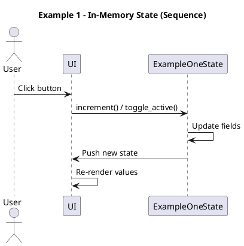
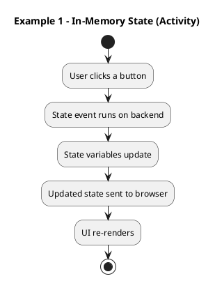
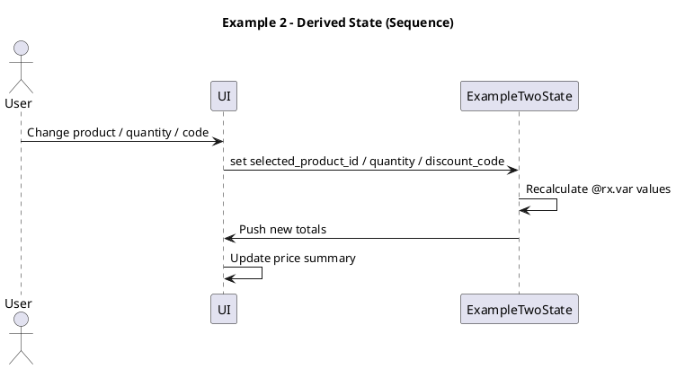
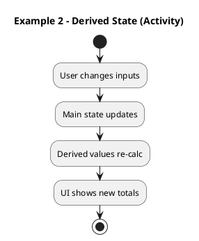
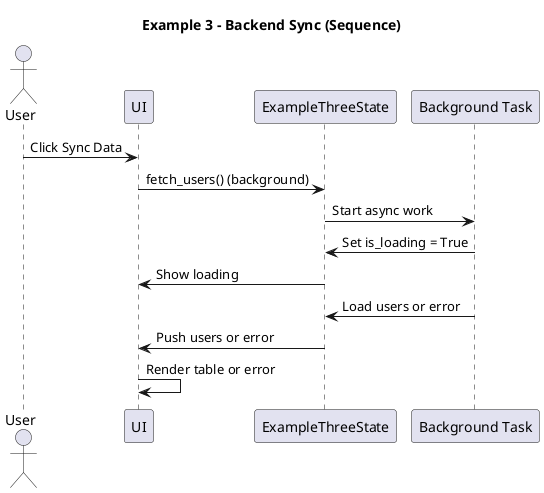
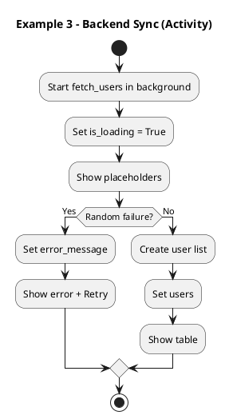
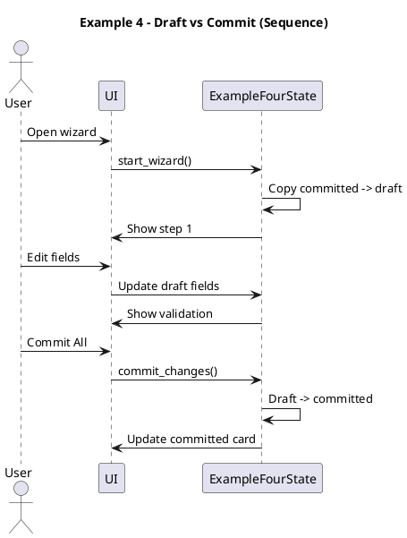
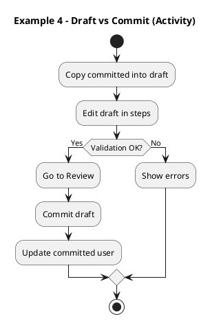

# Reflex State Examples - Kid-Friendly Tutorials (HackMD + PlantUML)

These four mini-lessons explain how each example uses State in Reflex. The language is simple on purpose.

---

## Example 1: Pure In-Memory State

### Big idea
State is like a whiteboard in your app. It lives in the Python backend and the screen stays in sync.

### What you can change
- `count`: a number.
- `is_active`: a yes/no switch.
- `is_premium`: another yes/no switch.
- `username`, `last_event`, `event_log`: text that tells what just happened.

### How it works (simple steps)
1. You click a button on the page.
2. That click runs a State event, like `increment()` or `toggle_active()`.
3. The State changes on the server.
4. Reflex sends the new State to the browser.
5. The UI re-renders with the new values.

### Try it
- Click **plus** to increase the number.
- Click **minus** to decrease the number.
- Flip the **System Active** and **Premium Tier** switches.
- Watch the event log update with each click.

### Diagram: sequence

### Diagram: activity

---

## Example 2: Derived State

### Big idea
Derived State is a calculator. It uses other State values and updates automatically.

### The main State pieces
- `selected_product_id`: which item is chosen.
- `quantity`: how many you want.
- `discount_code`: a code that can lower the price.
- `tax_rate`: the percent tax.

### The derived pieces (@rx.var)
- `selected_product`, `subtotal`, `discount_percent`, `discount_amount`, `tax_amount`, `total`.

You never set these directly. They are computed from the main State.

### How it works (simple steps)
1. You pick a product or change quantity.
2. The State updates the main values.
3. The derived values are re-calculated.
4. The price summary updates by itself.

### Try it
- Choose a different product.
- Set quantity to 3 or 5.
- Type a discount code like `REFLEX20`.
- Watch the subtotal, discount, tax, and total change.

### Diagram: sequence

### Diagram: activity

---

## Example 3: Backend Sync (Async State)

### Big idea
Sometimes State changes come from slow work, like a server call. Reflex can handle this in the background.

### The State pieces
- `users`: a list of people.
- `is_loading`: True while we wait.
- `error_message`: text if something goes wrong.

### How it works (simple steps)
1. The page loads and calls `fetch_users()` in the background.
2. `is_loading` becomes True, so the UI shows placeholders.
3. After a short wait, users are created and saved.
4. The table shows the new users.
5. Sometimes it fails (randomly), and you see an error with a retry button.

### Try it
- Click **Sync Data** to load users again.
- Click the trash icon to delete a user.
- If an error shows, click **Retry Connection**.

### Diagram: sequence

### Diagram: activity

---

## Example 4: Transactional Updates (Draft vs Commit)

### Big idea
Sometimes you want to edit data in steps, then save it all at once. This example uses a draft and a commit.

### Two versions of the data
- **Committed user**: the official saved data.
- **Draft user**: the temporary edits.

### How it works (simple steps)
1. `start_wizard()` copies the committed data into draft fields.
2. You edit the draft in steps (Profile -> Settings -> Review).
3. Validation checks the name and email.
4. You can **Discard & Reset** to roll back the draft.
5. You click **Commit All** to save the draft as the committed user.

### Try it
- Change the name and email.
- Pick a different theme and toggle notifications.
- Go to Review and click **Commit All**.
- Notice the committed card updates.

### Diagram: sequence

### Diagram: activity

---

## Quick recap
- Example 1: basic State + events.
- Example 2: derived State that auto-calculates.
- Example 3: async State that waits for data.
- Example 4: draft vs commit for multi-step edits.
